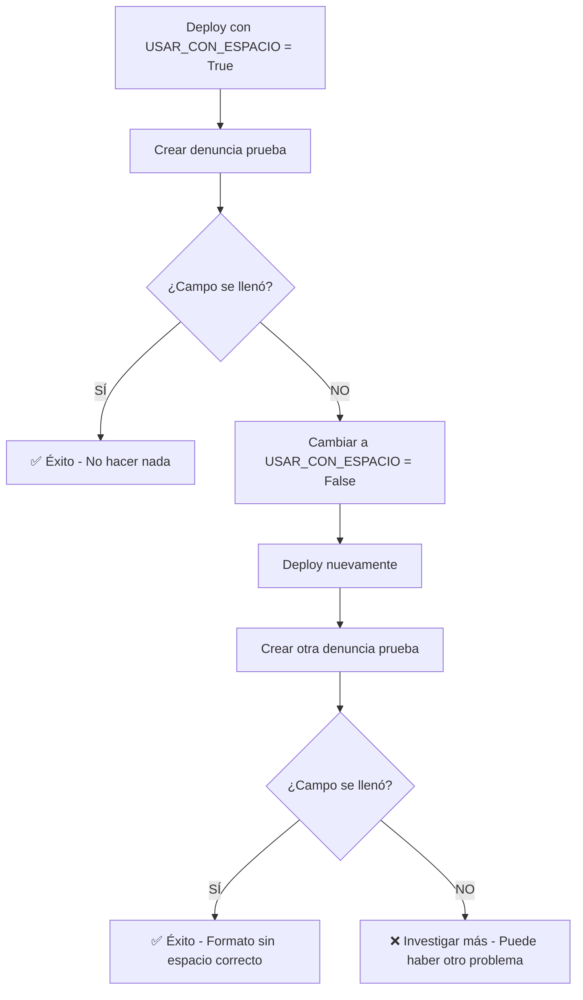

# 🔧 Guía: Cambiar Formato de ESTADO_WEB

## 📊 **Situación Actual**

El código está configurado con **FALLBACK AUTOMÁTICO** para manejar ambos formatos:

### **Formato CON espacio** (Actual - Por defecto)
```
"🆕 NUEVO WEB"  ← Hay espacio (U+0020) después del emoji
"👀 VISTO"
"✅ PROCESADO"
```

### **Formato SIN espacio** (Alternativo)
```
"🆕NUEVO WEB"  ← NO hay espacio después del emoji
"👀VISTO"
"✅PROCESADO"
```

---

## ✅ **Paso 1: Probar con Formato Actual (CON espacio)**

El código YA está implementado y listo para usar.

### **Verificar después del deploy:**

1. **Crear denuncia de prueba** desde el linktree
2. **Ver en Airtable** si ESTADO_WEB se llenó:
   - ✅ **Si se llenó:** El formato CON espacio es correcto → No hacer nada
   - ❌ **Si está vacío:** Pasar al Paso 2

---

## 🔄 **Paso 2: Cambiar a Formato SIN espacio (Si es necesario)**

Si después de probar el campo queda vacío, cambiar a formato SIN espacio:

### **Editar archivo:** `backend/main.py`

**Buscar la línea (~línea 54):**
```python
# Formato a usar (CAMBIAR AQUÍ si el principal no funciona)
# True = con espacio | False = sin espacio
USAR_CON_ESPACIO = True
```

**Cambiar a:**
```python
# Formato a usar (CAMBIAR AQUÍ si el principal no funciona)
# True = con espacio | False = sin espacio
USAR_CON_ESPACIO = False  # ← CAMBIAR AQUÍ
```

### **Hacer deploy:**
```bash
cd backend
git add main.py
git commit -m "fix: cambiar ESTADO_WEB a formato sin espacio"
git push origin main
```

### **Verificar nuevamente:**
1. Esperar deploy (~2 min)
2. Crear otra denuncia de prueba
3. Ver en Airtable si ahora SÍ se llena

---

## 🔍 **Paso 3: Verificar en Logs (Opcional)**

El código imprime en consola qué formato está usando:

```
📦 Payload Airtable keys: [...]
🏷️  ESTADO_WEB configurado: '🆕 NUEVO WEB' (formato: CON espacio)
```

**En Railway:**
1. Ir a Deployment Logs
2. Buscar la línea `🏷️  ESTADO_WEB configurado`
3. Ver qué formato se usó

---

## 📊 **Tabla de Decisión**

| Síntoma | Causa Probable | Solución |
|---------|---------------|----------|
| Campo vacío con `USAR_CON_ESPACIO = True` | Airtable espera sin espacio | Cambiar a `False` |
| Campo vacío con `USAR_CON_ESPACIO = False` | Airtable espera con espacio | Cambiar a `True` |
| Campo se llena correctamente | Formato correcto | ✅ No hacer nada |

---

## 🛠️ **Alternativa: Verificar Manualmente en Airtable**

Si quieres estar 100% seguro del formato antes de probar:

1. **Ir a Airtable** → Base de SEGUROS → Tabla `DENUNCIA DE ACCIDENTE`
2. **Hacer clic en el campo** `ESTADO_WEB` (cabecera)
3. **Ver opciones del Single Select**
4. **Copiar el texto EXACTO** de la primera opción
5. **Pegarlo en un editor** y ver si hay espacio invisible

### **Test rápido:**
```python
# Pegar el valor copiado entre las comillas:
valor_copiado = "🆕 NUEVO WEB"  # ← Pegar aquí

# Verificar:
print(f"Caracteres: {[c for c in valor_copiado]}")
print(f"Segundo carácter: '{valor_copiado[1]}' - ¿Es espacio? {valor_copiado[1] == ' '}")
```

---

## 📝 **Ejemplo de Uso en Código**

### **Usar los métodos (Recomendado):**
```python
# Automáticamente usa el formato correcto
airtable_payload["ESTADO_WEB"] = EstadoWeb.nuevo_web()
```

### **Usar constantes directamente (No recomendado):**
```python
# Si necesitas acceso directo:
if EstadoWeb.USAR_CON_ESPACIO:
    valor = EstadoWeb.NUEVO_WEB_CON_ESPACIO
else:
    valor = EstadoWeb.NUEVO_WEB_SIN_ESPACIO
```

---

## ✅ **Estado Actual del Código**

```python
class EstadoWeb:
    # CON espacio (formato técnico según API)
    NUEVO_WEB_CON_ESPACIO = "🆕 NUEVO WEB"
    VISTO_CON_ESPACIO = "👀 VISTO"
    PROCESADO_CON_ESPACIO = "✅ PROCESADO"

    # SIN espacio (formato alternativo visual)
    NUEVO_WEB_SIN_ESPACIO = "🆕NUEVO WEB"
    VISTO_SIN_ESPACIO = "👀VISTO"
    PROCESADO_SIN_ESPACIO = "✅PROCESADO"

    # CONFIGURACIÓN
    USAR_CON_ESPACIO = True  # ← CAMBIAR AQUÍ

    @classmethod
    def nuevo_web(cls):
        return cls.NUEVO_WEB_CON_ESPACIO if cls.USAR_CON_ESPACIO else cls.NUEVO_WEB_SIN_ESPACIO
```

---

## 🚀 **Flujo de Testing Recomendado**



---

## 💡 **Datos Técnicos de Referencia**

### **Según Airtable Meta API:**
```json
{
  "name": "ESTADO_WEB",
  "type": "singleSelect",
  "options": {
    "choices": [
      {"name": "🆕 NUEVO WEB"},  // ← Con espacio
      {"name": "👀 VISTO"},
      {"name": "✅ PROCESADO"}
    ]
  }
}
```

### **Según registros poblados:**
- 3 registros encontrados con campo lleno
- Todos usan: `"🆕 NUEVO WEB"` (con espacio U+0020)

### **Conclusión inicial:**
Por datos técnicos, el formato CON espacio debería funcionar.
Pero se provee fallback por si UI muestra diferente.

---

## 📞 **Si Ningún Formato Funciona**

Posibles causas alternativas:

1. **Typo en nombre del campo:** Verificar que sea exactamente `ESTADO_WEB`
2. **Permisos del API Key:** Verificar que tenga permisos de escritura
3. **Error anterior en el código:** Ver logs completos del backend
4. **Campo en tabla incorrecta:** Verificar que `tabla_destino` sea correcta

**Ver logs completos en Railway:**
```
Buscar: "Error creando registro en Airtable"
O: "Unknown field name"
```
